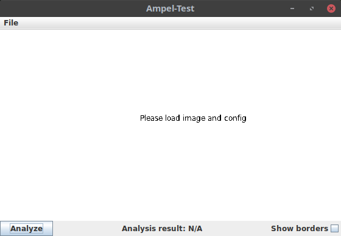
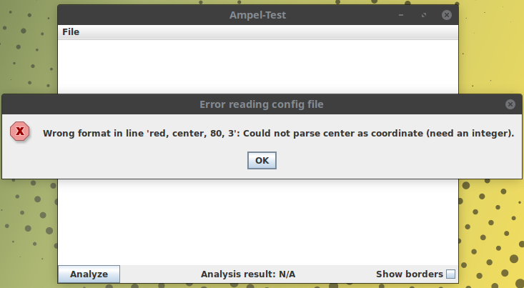
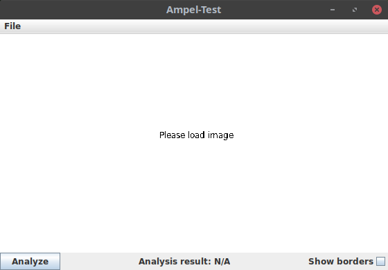
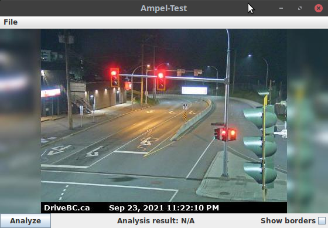

# Erkennung eines Ampelsignals

## Hintergrund

In dieser Aufgabe entwickeln Sie eine automatisierte Erkennung von Ampelsignalen. Stellen Sie sich vor, Sie sind bei windy.com angestellt, um die API zu erweitern. Die Firma konnte öffentliche Mittel einwerben, um die Forschung zur Sicherheit im Straßenverkehr zu unterstützen. Im Rahmen dieses Projekts soll für Webcam-Bilder, auf denen Ampeln zu erkennen sind, die Information bereitgestellt werden, ob die Ampel auf grün, gelb oder rot steht.

Sie sollen ein Modul entwickeln, welches ein Bild sowie die Koordinaten der Ampel bekommt und die Klassifikation - rot, gelb oder grün - zurückgibt. Zudem sollen Sie ein GUI entwickeln, mit dem die Funktionalität Ihres Moduls überprüft werden kann.

Beispielbilder von einer [Webcam in Haney, die eine Ampel anzeigt](https://www.windy.com/-Webcams/Canada/British-Columbia/Haney/-Hwy-(Lougheed-Hwy)-at-Bypass/nd-Street-looking-south/webcams/1609183932?53.422,12.640,9) sowie eine Konfigurationsdatei ```config.txt``` mit passenden Koordinaten finden Sie im Ordner ```data```.

## Benotung

Bei den automatischen Tests können Sie bis zu 70 Punkte erreichen:
* ```Configuration```: 15 Punkte
* ```FormatException```: 10 Punkte
* ```LightImage```: 30 Punkte
* ```Light```: 15 Punkte

Für die Benotung der GUI-Entwicklung laden Sie am Ende 6 Bilder hoch. Für jedes dieser Bilder gibt es 5 weitere Punkte, also insgesamt 30 Punkte für das GUI.

## Einlesen der Konfiguration

Die Konfigurationsdatei enthält zeilenweise kommagetrennt die Informationen zu den einzelnen Ampelsignalen sowie optinal mit ```#``` beginnende Kommentarzeilen:

```text
# color, x, y, radius
red, 274, 80, 3
yellow, 274, 90, 3
green, 274, 99, 3
```

Kommentarzeilen können beim Einlesen ignoriert werden. Die sonstigen Zeilen müssen jeweils 4 Elemente enthalten: Einen String, der die Signalfarbe bezeichnet (das kann ein beliebiger Namen sein), sowie drei Zahlen: Die x- und die y-Koordinate gefolgt von dem Radius.

### Configuration

Implementieren Sie zunächst eine Klasse ```Configuration```, die zum Einlesen der Konfigurationsdatei genutzt wird. Sie soll die zwei folgenden Methoden enthalten:
* ```public Configuration(File configfile) throws IOException, FormatException```: Constructor zum Einlesen der Konfigurationsdatei. Wirft bei Fehlern die entsprechende Exception: ```IOException``` bei allgemeinen Lesefehlern (Datei nicht da, keine Leserechte etc.) oder ```FormatException``` falls das Dateiformat falsch ist.
* ```public List<Light> getLights()```: Gibt die Liste der eingelesenen Signale zurück.

Implementieren Sie dafür die Hilfsklassen ```Light``` sowie ```FormatException```.

### Light

Die Klasse ```Light``` soll die Informationen über ein Signal enthalten und die folgenden Methoden enthalten:
* ```public Light(String configline) throws FormatException```: Constructor, der eine Zeile aus der Konfigurationsdatei bekommt und die entsprechenden Daten in dem neuen Objekt speichert. Wirft eine ```FormatException``` mit der entsprechenden Meldung, falls:
    * Keine 4 Elemente in der Zeile vorhanden sind: "Wrong number of elements."
    * Die X- oder Y-Koordinate keine Zahl ist: "Could not parse WERT as coordinate (need an integer)."
    * Der Radius keine Zahl ist: "Could not parse WERT as radius (need an integer)."
* Getter für die Koordinaten, den Radius und den Namen
    
### FormatException

Die Klasse ```FormatException``` leitet von Exception ab und beinhaltet die Informationen über einen Fehler im Dateiformat. Sie soll die folgenden Methoden enthalten:
* ```public FormatException(String line, String error)```: Constructor.
* ```public String getLine()```: Gibt den Inhalt der Zeile, in der der Fehler aufgetreten ist, zurück.
* ```public String getError()```: Gibt die Beschreibung des Fehlers zurück.
* ```public String getMessage()```: Überschreibt ```getMessage()``` aus ```Exception```. Gibt die folgende Message zurück: "Wrong format in line '<Zeileninhalt>': <Fehlerbeschreibung>.".

## Einlesen und Analysieren eines Bildes

Implementieren Sie nun zum Einlesen und Analysieren eines einzelnen Bildes die Klasse ```LightImage``` mit den folgenden Methoden:
* ```public LightImage(File imagefile) throws IOException```: Constructor, liest das Bild in ```imagefile``` als ```BufferedImage``` ein. Falls beim Einlesen eine ```IOException``` auftritt, soll diese weitergeworfen werden.
* ```public BufferedImage getImage()```: Gibt das BufferedImage für das eingelesene Bild zurück.
* ```public double getLightIntensity(Light light)```: Gibt die **durchschnittliche** Intensität der Pixelwerte innerhalb der Koordinaten des übergebenen ```Light```-Objekts in dem Bild zurück. Die Intensität eines Pixelwerts ist dabei definiert als die Summe der Rot-, Grün- und Blau-Werte des Pixels.
* ```public boolean isInLight(int x, int y, Light light)```: Hilfsfunktion, die bestimmt, ob ein Punkt mit den übergebenen x- und y-Koordinaten innerhalb der Koordinaten des übergebenen ```Light```-Objekts liegt (also innerhalb eines Kreises mit dem angegebenen Radius um die angegebenen Koordinaten des Lichtsignals).
* ```public String getActiveLight(List<Light> lights)```: Gibt den Namen des Lichts aus der übergebenen Liste zurück, welches die höchste Intensität auf dem Bild hat.

## GUI

Nun haben Sie alles, was Sie für die Analyse brauchen - es ist an der Zeit, das GUI zu implementieren.

Wie in den Hausaufgaben gibt es für das GUI keine automatisierten Tests. Entsprechend wird die in den nächsten Abschnitten vorgeschlagene Programmstruktur nicht überprüft - Sie können davon auch abweichen, solange ein den Anforderungen entsprechendes GUI entsteht. 

### ImagePanel

Implementieren Sie für die Darstellung eines LightImage-Bildes eine Klasse ```ImagePanel```, die von ```JPanel``` ableitet und die folgenden Methoden enthält:

* ```public ImagePanel()```: Constructor. Setzen Sie hier der Einfachkeit halber die Größe starr auf 560x315 Pixel, das ist die Größe der Bilder im data-Verzeichnis.
* ```public void setImage(LightImage image)```: Setzt das anzuzeigende ```LightImage```. Sollte die Darstellung aktualisieren.
* ```public void setConfig(Configuration config)```: Setzt die Konfiguration. Sollte die Darstellung aktualisieren.
* ```public LightImage getImage()```: Gibt das angezeigte ```LightImage``` zurück.
* ```public Configuration getConfiguration()```: Gibt die gesetzte ```Configuration``` zurück.
* ```public void setShowBorder(boolean show)```: Stellt ein, ob die Positionen der Lichter angezeigt werden sollen (wird verwendet, wenn das Häkchen bei "Show borders" gesetzt wird). 
* ```public void paintComponent(Graphics g)```: Überschreibt die Methode aus ```JPanel```:
  * Falls Konfiguration und/oder Bild noch nicht geladen wurden, sollte einfach nur auf weißem Hintergrund "Please load image and config", "Please load image" oder "Please load config" stehen.
  * Falls Bild und Konfiguration geladen sind, soll das Bild angezeigt werden
  * Falls in dem Hauptfenster das Häkchen bei "Show borders" gesetzt wurde, sollen die in der Konfiguration definierten Lichter mit Kreisen angezeigt werden (Sie können dafür die Methode ```drawOval()``` verwenden)

### MainFrame

Die Klasse ```MainFrame``` soll von ```JFrame``` ableiten und das Hauptfenster darstellen. Dabei sollen das GUI folgende Elemente enthalten:
* Ein ```JMenuBar``` mit einem ```JMenu``` "File" und den folgenden ```JMenuItem```s:
  * "Load configuration": Zeigt ein Popup zum Laden einer Text-Datei, liest diese als ```Configuration``` ein und setzt sie im ```ImagePanel```
  * "Load LFA image": Zeigt ein Popup zum Laden einer Bild-Datei, liest diese als ```LightImage``` ein und setzt es im ```ImagePanel```
  * "Exit": Beendet das Programm
* Ein ```ImagePanel``` oben (ich empfehle ein ```BorderLayout``` und das ```ImagePanel``` an der Position ```BorderLayout.CENTER```)
* Ein Button mit dem Text "Analyze", ein JLabel das das Analyseergebnis anzeigt (bzw. "Analysis result: N/A", falls keine Analyse durchgeführt wurde), sowie eine Checkbox mit dem Text "Show borders". Ich empfehle ein ```JPanel``` wieder mit ```BorderLayout``` in dem die Labels und die Checkbox hinzugefügt werden (die Checkbox kann man mit ihrem Label auch in einem separaten JLabel zusammenfassen, dann sind es genau drei Kontrollelemente, die man in BorderLayout.WEST, .CENTER und .EAST hinzufügen kann) und welches an der Position ```BorderLayout.SOUTH``` dem ```MainFrame``` hinzugefügt wird.

Falls beim Laden einer Datei ein Fehler auftritt, soll dieser über ein Popup mit ```getMessage()``` der aufgetretenen Exception angezeigt werden.

### Screenshots

Hier finden Sie Screenshots von dem erwarteten Verhalten des Programms (es muss wie besprochen bei Ihnen nicht pixelgenau identisch aussehen, aber von der Idee her soll es so funktionieren):

#### Frisch geöffnetes Programm



#### Fehler beim Laden einer Konfigurationsdatei



#### Nur Konfiguration geladen 



#### Bild und Konfiguration geladen (ohne "Show borders")



#### Bild und Konfiguration geladen (mit "Show borders")


#### Analyse durchgeführt


### AmpelGUI

Die Main-Klasse ```AmpelGUI``` braucht nur eine ```main```-Methode enthalten, in der ein ```MainFrame``` erstellt und sichtbar gemacht wird - sie ist nur die Einstiegsklasse in das Programm.

### GUI-Abgabe

Wie in den Hausaufgaben gibt es für das GUI wie beschrieben keine automatisierten Tests. Ersetzen Sie stattdessen die Dateien "result1.png"-"result6.png" durch Screenshots von Ihrem Programm, die die gleichen Zustände zeigen (in der gleichen Reihenfolge) wie die Beispielscreenshots oben. Ihre Screenshots sollten dann hier erscheinen. Für jeden der Screenshots gibt es **5 Punkte**.

Verwenden Sie dabei eine beliebige Datei aus dem data-Ordner (oder auch ein anderes passendes Bild von windy.com, dann aber mit passender Konfiguration - es sollte bei der Analyse was korrektes rauskommen).

#### Lösung: Frisch geöffnetes Programm


#### Lösung: Fehler beim Laden einer Konfigurationsdatei


#### Lösung: Nur Konfiguration geladen


#### Lösung: Bild und Konfiguration geladen (ohne "Show borders")


#### Lösung: Bild und Konfiguration geladen (mit "Show borders")


#### Lösung: Analyse durchgeführt


# Zusatzaufgabe

Für bis zu 10 Bonuspunkte können Sie folgende Zusatzaufgabe bearbeiten: Erweitern Sie das Programm so, dass anstatt nur einer Bilddatei mehrere ausgewählt werden können. Fügen Sie Ihrem Programm zudem unter dem ```ImagePanel``` zwei Buttons zum Blättern hinzu, mit denen jeweils das nächste bzw. das vorherige Bild angezeigt werden können. Bei Klick auf einen dieser Buttons soll neben der Darstellung im ```ImagePanel``` natürlich auch die Anzeige der berechneten Ergebnisse aktualisiert werden. Hinweis: Das lässt sich recht einfach durch eine Erweiterung von ```MainFrame``` lösen, ohne ```ImagePanel``` zu verändern.

Fügen Sie als Lösung aussagekräftige Screenshots im Ordner "Bilder" hinzu und erweitern Sie die README.md so, dass diese unter diesem Satz angezeigt werden (ähnlich wie die Lösungen des Pflichtteils weiter oben). 
